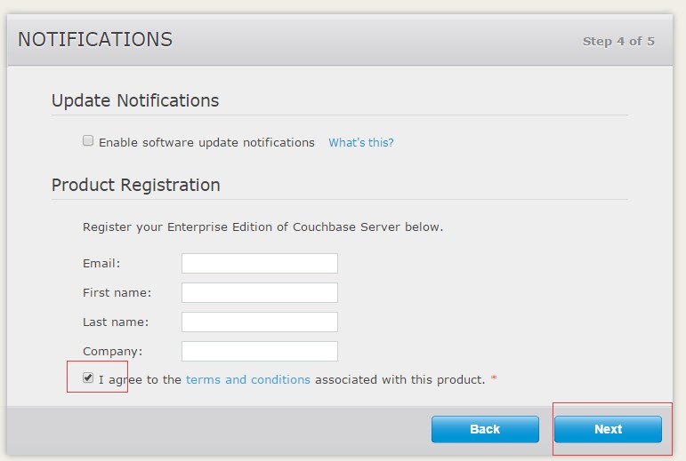
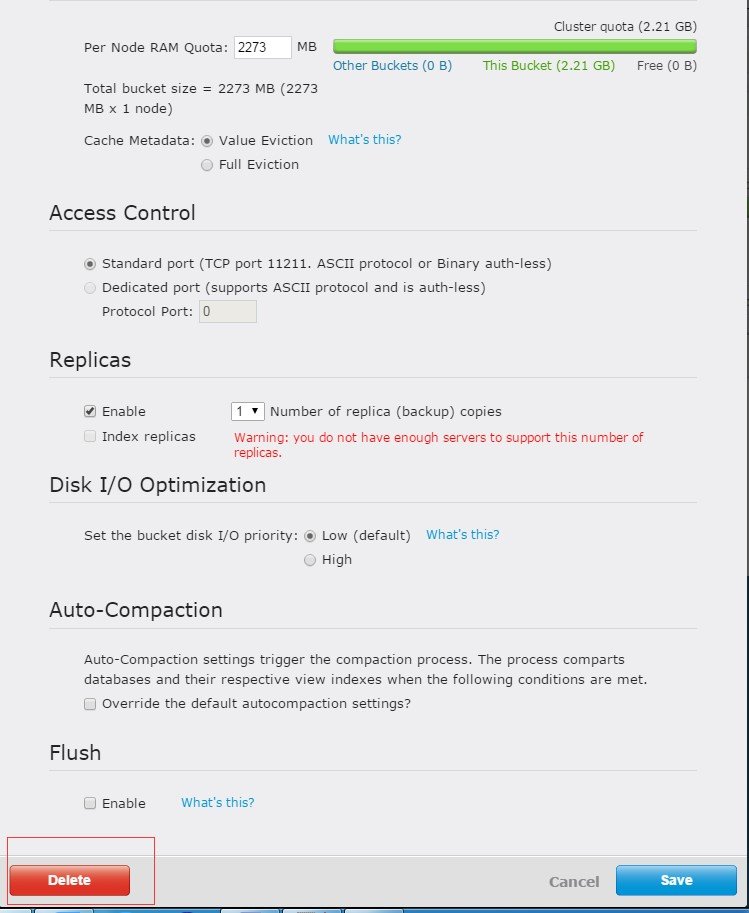

# Couchbase简介
Couchbase Server 是一款面向互联网应用的文档型数据库。它具有松散的数据组织方式，良好的扩展性，稳定的高性能和7X24不间断服务能力。Couchbase Server主要具有下述优点：
* 松散的数据组织方式

  通过Couchbase Server，你可以使用JSON文档来描述应用主体以及它们之间的关系。因为其松散的数据组织方式，所以你可以随意改变应用主体而不必考虑其它因素，比如说数据库的schema或者为了适应改动而暂停服务。即使是相同的应用主体也可以在其内部有不同的数据结构。打个比方，你一开始在文档中把名字存在一个单独的field中。之后你可以在另一个文档中把姓和名拆开存在两个field中，而这并不会与其它文档冲突，你也不需要重启服务。松散数据组织的另一个好处就是这种方式很适合表现现实世界中的事物。JSON文档支持嵌套结构，而且field也代表着文档间的关系，因此合理应用JSON文档就可以在你的应用中还原数据的相互关系。

* 良好的扩展性

  在Couchbase Server中你可以简单地就扩展你的应用，无论是在一个集群内还是在多个集群不同数据中心间。你可以通过向Couchbase Server添加更多成员的方式来解决增长的用户和数据带来的压力，而且不需要对当前的服务或应用进行任何改变。只需要鼠标轻轻一点，你就可以迅速在你的Couchbase Server集群之中保持负载和数据的均匀分布。
  Couchbase Server提供自动数据分片和运行中负载均衡的服务，这可以让你按需随时调整集群大小。Couchbase Server 2.0开始提供的跨数据中心复制功能则可以让数据从其它数据中心自动移动到最接近用户的数据中心。

* 稳定的高性能

 Couchbase Server一开始就是为高并发数据使用和稳定的高吞吐量而设计的。它提供亚毫秒级别的响应时间以保证你的应用有良好的用户体验。而Couchbase Server通过提供稳定的高吞吐量，你可以使用更少的服务器来支持更多的用户。服务器也会自动把负载分散到集群之中，这样每一台服务器都不会成为瓶颈，因此保证了稳定的性能。

* 不间断服务

  跨数据中心复制和自动失效转移等功能特性确保了无论是集群之内还是集群之间数据的持久性。

Couchbase Server拥有的这些特性使它可以支持终端用户需求低延迟和高吞吐的网络应用。网络应用可以在Couchbase集群内快速获取数据，开发者可以增加服务器以扩展应用。

# Couchbase安装
目前最新版本的Couchbase版本为4.6，而我公司使用版本为4.1。
## 创建cluster
参考以下命令获取安装包和安装脚本，详细步骤参考安装手册。
```shell
get couchbase-server-enterprise-4.1.0-centos6.x86_64.rpm
get couchbase_setup.sh
mv couchbase-server-enterprise-4.1.0-centos6.x86_64.rpm
 /ztsoft/usr/sysusr/
sh couchbase_setup.sh
```

浏览器登录 http://IP:8091 ，弹出如下界面。IP使用上一步安装节点的ip地址。


点击**Setup**


指定data和index存储路径，以及server hostname。然后就开始创建bucket。
## 创建bucket


按照实际情况填写RAM Quota值。

注册信息可不填。


配置couchbase管理界面用户名和密码 :cbsadmin/xxxxxxxx

## 加入cluster
Couchbase用于创建集群时，还需要添加其它节点到集群中。
浏览器登录待加入节点的管理 http://IP:8091


需要注意**Join a cluster now**选项。


## 常用操作
#### 删除默认的bucket



#### rebalance


#### 创建bucket


## 其他配置操作
#### 设置集群名字

#### 设置failover

#### 设置告警

在alerts页面配置host为10.40.34.201，port为25，Sender email:couchbase@ect888.com，Recipients:couchbase@ect888.com
#### 设置只读用户


#### 配置XDCR


# 基本概念
Couchbase服务器可以单独运行，也可以作为集群运行。在Couchbase集群里，运行一个或多个Couchbase实例。集群里所有节点是平等的，提供相同的功能和信息，没有层次结构的概念，也没有主节点、从节点之分。整个集群共享每个独立节点的信息，每个节点负责对数据的一部分进行响应。

集群是水平扩展的。要增加集群的容量，只需加多一个节点。节点间没有父子关系或者层次结构。这意味着Couchbase在存储容量和性能方面，都可以做到线性扩容。

## 架构和构思
为了理解Couchbase Server的结构和设计，首先需要理解组成单一Couchbase Server个体的组件和系统，以及组成Couchbase集群的组件和系统。

后文会提供理解Couchbase Server数据库高速、易扩展性质的关键信息和构思，以及不同组件如何协同工作来支持这个高性能数据库。

## Nodes和Clusters
Couchbase Server既可以单独设置使用，也可以作为集群设置使用。在集群之中Couchbase Server连接在一起，数据在集群之内分散存储。

在本文中，需要明白几个术语：
* Couchbase Server或Node

  一个在机器上运行着的Couchbase Server实例，可以是实体机器、虚拟机、容器。所有Couchbase Server实例都是相同的，提供相同功能、接口和系统，包含相同的组件。

* Cluster

 一个cluster是一个包含一个或多个Couchbase Server实例而且作为一个逻辑上的cluster设置的集群。所有cluster内的node都是相同的，提供相同的功能。每个节点都可以管理cluster并提供其统计数据和操作信息。用户数据通过vBucket系统存储在整个cluster之中。

 集群操作完全是水平的。如果需要扩张cluster的大小，只需要添加node即可。集群没有层级关系或者中心管理节点。这意味着Couchbase Server是线性扩展，无论是在储存容量、性能还是扩展性上。

* Bucket
  一个Bucket就是包含项目集合例如KV键值对或文档的逻辑容器。它类似于关系型数据库里的数据库。它为包含的数据组提供了一个资源管理设施。

* Cluster Manager

  Couchbase Cluster内的每一个Node都包含Cluster Manager组件。这个组件负责cluster内的以下工作：
  *	Cluster拓扑管理
  *	Node管理
  *	Node监控
  *	数据采集和聚合
  *	运行时日志记录
  *	多租户
  *	客户端访问的安全认证
  *	用于重定向请求的客户代理服务


  CM包含以下模块来执行上述工作：
  * REST API和auth，通过它们进行通信和认证，所有通过CLI工具进行的管理操作或者管理入口都通过管理REST API执行
  * Master Services,管理整个集群级别操作例如主副vBucket放置，自动故障切换和再均衡
  * Bucket Serives，管理bucket级别操作，例如建立和处理复制维护或者Bucket级别统计收集
  * Per-node Services，管理节点健康和进程/服务的监控和重启
  * Cluster manager generic local and distributed facilities，管理本地和分布式配置管理，集群级别日志。

## 数据存储
Couchbase Server使用buckets来提供数据管理服务。buckets是为数据准备的互相隔离的虚拟容器。一个bucket就是一个cluster内物理资源的一个逻辑上的分组，可以通过cluster被多个客户使用。Buckets提供了一种安全的组织、管理和分析数据资源的机制。

Couchbase Server中有两类bucket: 1) memcached buckets，以及 2) couchbase buckets。这两种bucket让你可以选择仅把数据缓存在内存里，还是既缓存在内存里也为了持久性同步到硬盘上。当你建立Couchbase Server时可以选择使用哪种bucket：

| Bucket Type   | Description |
| ------------- |:-------------|
| Couchbase     | 提供高可用并可动态重构的分布式数据存储，同时兼顾持久性和备份服务。此类型bucket 100%兼容memcached开源分布式键值对缓存协议，因为它就是从其中发展出来的。 |
| Memcached     | 提供直接寻址、分布式（可水平扩展）、内存中、键值对的缓存。Memcached类型的bucket应与关系型数据库技术协同使用——把频繁访问的热数据缓存在内存之中以减少Web应用对数据库的查找。      |

Couchbase类型的bucket提供高可用性的可动态重构的分布式数据储存。节点故障不会丢失数据，重新配置cluster也会保证继续提供服务。Couchbase类型的bucket有以下核心能力：

| Capability    | Description |
| ------------- |:-------------|
| Caching       |Couchbase bucket通过RAM操作。数据保持在RAM上并同步到硬盘中，直至RAM资源耗尽才被擦除。如果请求的数据没有缓存在RAM中，它会自动从硬盘中加载。|
| Persistence   | 数据以异步的方式从内存同步到硬盘以避免服务重启或故障损毁数据。持久性相关的参数在bucket级别进行设置。|
| Replication   | 可以配置会接收到所有数据备份的复制服务器数量。如果主服务器失效，备份服务器会升级为主服务器，通过失效转移保证集群的高可用性。备份相关参数在bucket级别设置。|
| Rebalancing   | 再均衡会在cluster内平分负载并动态增删bucket和server。|
不同的Bucket类型也提供了不能的能力，如下表。

| Capability    | memcached Buckets | Couchbase Buckets |
| ------------- |:-------------:| :-------------: |
|Item Size Limit| 1 MByte| 20 MByte|
|Persistence	|No	|Yes
|Replication	|No	|Yes
|Rebalance	|No	|Yes
|Statistics	|Limited set for in-memory statistics	|Full suite
|Client Support	|Ketama consistent hashing	|Full Smart Client Support|
|XDCR |NO|YES|
|Backup |NO|YES|
|TAP/DCP |NO|YES|
|Encrypted data access |NO|YES|

共有三种可以设置的bucket：
* Non-SASL Buckets

  可以将Non-SASL buckets 通过11211以外的端口访问，11211留给default bucket使用。一个端口上只能安排一个Non-SASL bucket。此类bucket可以通过一个识别vBucket的智能客户端、一个ASCII客户端或者是不使用SASL认证的二进制客户端访问。

* SASL Buckets

  SASL认证的Couchbase buckets设置在11210端口，不同bucket通过名称和密码区别。SASL bucket不应该在11210以外的端口设置。此类buckets可以通过识别vBucket的智能客户端或支持SASL认证的二进制客户端访问，不可通过ASCII客户端访问。

* The default Bucket

  default bucket是Couchbase server特殊的bucket，预留11211端口,并且使用Non-SASL认证。当Couchbase Server安装成功时default bucket会自动安装。这个bucket也可以在安装后卸载，如果需要也可以重新添加，只需要在11211端口上以default为名称添加一个non-SASL类型的bucket即可。default bucket可以通过一个识别vBucket的智能客户端（SDK）、一个ASCII客户端或者是不使用SASL认证的二进制客户端访问。  

智能客户端通过Couchbase Management预留的REST API发现cluster的改动。使用SASL Buckets可以隔离不同的访问者以实现多租户或者隔离缓存中不同类型的数据来提高性能和可见性。Couchbase server允许你用不同的端口来访问不同的bucket：
* non-SASL buckets
* 使用SASL认证的二进制协议的隔离bucket
* 或者使用无认证的ASCII协议来访问的隔离bucket。

根据需要在Couchbase Server中使用混合类型的buckets（Couchbase和Memcached）是没什么问题的。不同的buckets依然分享共同的资源池和cluster。每个bucket会单独设置RAM和硬盘的配额，以方便在cluster中管理资源的使用。作为管理员可以在运行的cluster上修改配额，当使用模式或者优先级改变时灵活调节资源分配。

## RAM Quotas
RAM在Couchbase Server中以两种不同的方式分配，Server Quota和Bucket Quota。

* Server Quota

  Server Quota是Couchbase Server首次安装后分配给服务器的内存。它限定了Couchbase在每个node为所有buckets分配总内存的上限。Server Quota在cluster中第一个加入的node上首次设置并应用到所有node之中。比如说你有10个node，设置为16GB的Server Quota，那么cluster之中总共有160GB RAM可用。此时往cluster之中再添加两个node，新加入的node需要各自保留最低16GB的RAM，加入之后cluster总可用RAM增长至192GB。
  Server Quota根据相关service不同，分为三种：
  * Index RAM Quota
  * Search RAM Quota
  * Data RAM Quota

* Bucket Quota

  Bucket Quota是每个节点上某个bucket为了缓存数据申请的RAM资源，并且是从Server Quota中申请。比如说在一个10 node的cluster中创建了一个Bucket Quota为1GB的，那么cluster中总共就是10GB的bucket quota。往cluster中添加两个node则bucket quota增加至12GB。
  

  从上面的描述和图表中可以看到往cluster中添加新的node将提升总体的RAM配额，增加可以在RAM中保持的数据量。

  Bucket Quota被系统用于判断何时从内存中擦除数据。Bucket Quota在Server Quota的范围内可以动态调节，因此你可以根据实际需求单独控制不同bucket的缓存策略。

  Server Quota也可以动态调节，但是必须确保cluster中的node有足够的物理资源来支持。

## vBuckets
一个vBucket是cluster内一个key space子集的所有者。vBuckets用来在cluster内有效地分布信息。vBucket系统既是为了分布数据，也是为了在多节点备份数据。

客户端直接访问负责对应vBucket的node以获取存储在bucket内的信息。这样直接访问方式让客户端直接访问储存数据的节点而不是通过代理或再分布的架构。直接访问的好处是通过vBucket从逻辑上的数据分区中提取出了物理拓扑。这样的架构赋予了Couchbase以很大的弹性和灵活性。

这种架构与memcached采取的不同，后者在客户端对key进行hash来从一个给定的列表中选择服务器。这样的方式要求时刻保持对列表中服务器的管理，以及为了适应拓扑变化而采取特殊的hash算法，比如Ketama。不过这种架构也比RDBMS环境下采用的分片方式更有弹性更能适应拓扑变化。

**Note:**
*vBuckets不是对用户可见的，但它是Couchbase的核心组件并且对扩展性起着至关重要的作用。*

每一个document ID都隶属于一个vBucket。使用一个映射函数计算给定document隶属于哪个vBucket。在Couchbase Server中，映射函数是个输入document ID输出vBucket标识符的hash函数。得到vBucket标识符后，就从一个表中查询持有该vBucket的Server。这个表每一行包含一个vBucket，并且把vBucket和对应的Server配对。这个表中的Server可以（而且通常）都会与多个vBucket配对。

下面的表格展示了vBucket映射函数是如何工作的。cluster中有三个Server。客户端首先计算KEY对应的vBucket。这个例子中，hash结果是vB8。检查vBucket映射表之后，客户端发送GET请求访问VB8代表的Server C。


考虑第二种情景。过了一段时间之后，需要在cluster中添加一个server。Server D加入了cluster。


**Note:**
*vBucket映射表通过再均衡操作进行了更新，并在更新后发送至cluster中所有成员，包括node、任何连接中的智能客户端以及moxi代理服务。*

在新的4-node cluster中，当客户端再次对KEY进行hash时，结果依然是映射到vB8。然而新的vBucket映射表现在把vB8映射给Server D。因此客户端直接与Server D通讯。

## 缓存层
Couchbase Server的架构包括一个内置的缓存层。这个缓存层是服务器的中心，提供高速读写。其它数据库从硬盘中读写数据，从而拖慢了性能。解决这个问题的一个方案就是安装并管理一个缓存层作为一个独立的组件来与数据库协同工作。这个方案也有问题，因为管理缓存层和管理数据在缓存层和数据库之间的流通需要大量的额外代码和维护。

而Couchbase Server则自动管理缓存层、自动协调缓存层与磁盘交互以预留足够的缓存空间来维持性能。Couchbase把新写入缓存的数据自动添加到磁盘的写队列中以保证持久性。如果server判断缓存中的数据已经不足够活跃，就会把数据从缓存中移除，把空间留给其它数据。当然server也可以在请求获取冷数据时把不在缓存中的数据从磁盘中取出并缓存在内存。上述整个缓存层和磁盘的交互都是server自行处理的。为了在保持高性能的基础上提供访问频率最高的数据，Couchbase Server管理着一个包含所有信息的工作集，包括了所有活跃信息并为了高性能而保持在内存中。

Couchbase在后台以异步的方式自动管理数据在RAM和磁盘中的流动，以保证热数据在内存中且冷数据被及时从内存中擦除。Couchbase始终监视着客户端访问的信息，以此为基础判断哪些数据需要保存在缓存层。数据在后台自动被从内存洗刷到硬盘，而且不妨碍服务器保持对请求的处理。在数据库的写负担很重时，客户端会被告知服务器暂时空间不足，直至足够多的数据被从内存中洗刷到磁盘上。异步模式和排队系统带来了快速的读写以及平稳的性能，而不是在RDBMS环境下不稳定的表现。

当数据是储存在磁盘上并且有客户端要求访问时，客户端发送document ID然后服务器判断这个ID的文档是否存在。这个过程借助metadata结构完成。metadata结构在内存中缓存着数据库中每个文档的基本信息，这意味着服务器可以快速地判断出文档是否存在、是否缓存在RAM中以及是否需要从磁盘中读取数据。

## 磁盘存储
Couchbase主要在RAM中完成客户端所需信息的存取以保证性能。而同时也会最终把所有内存中的数据同步到硬盘以获取更高级别的持久性。如果一个node出现故障因而丢失了所有缓存层中的数据，你依然可以从磁盘中恢复数据。我们把这个过程称之为延迟同步到磁盘，因为服务器并不会在把数据写入硬盘时锁定客户端，而是把数据先写入缓存层再把数据插入磁盘写入队列等待写入。磁盘持久化允许你进行备份和恢复操作，也可以让你存储比缓存层容量更大的数据。

当服务器判断需要从磁盘中取出数据时，后台进程会处理读取队列，从磁盘中取出信息并放在内存里。在这个过程中客户端会保持等待直至数据被取出。

**多读写**

多线程读写提供了对硬盘数据的同时读写操作。在Couchbase早期版本中，每个server只有一个读线程和一个写线程。而现在单读写线程已经跟不上磁盘的速度了。单读写线程的另一个问题是如果有大量数据在磁盘而不在RAM中，当请求数据时就会体验极高的cache miss ratio。为了能够有效利用磁盘的写入速度，提高从磁盘读取数据的速度，我们现在使用多线程来读写，这样一来多个进程就可以一起在磁盘上读写了：


这个多线程引擎在线程间对访问相同数据的线程采用同步的形式来避免冲突。为了在避免访问数据冲突的同时保持性能，Couchbase server在线程和静态分区的vBuckets之间分配线程上使用了锁。当Couchbase创建了多个读写线程时，服务器生成一组vBucket并绑定到每个线程上。这样静态线程协调后，服务器就可以合理安排线程，让任何时刻都只有一个读线程和一个写线程访问相同的vBucket。在上面的图示中示范了这个机制，包括六个预先分配的线程和两个data Bucket。每个线程都有一组静态分区的vBucket来应对读写。

**删除item**

只有当客户端明确要求从数据库中删除某个文档或文档的expiration 标记已经到达时，Couchbase才会从磁盘中删除item。弹出机制会在把文档从内存中移除的同时保留包含文档的key和metadata在内存之中，也会把文档同步到磁盘上。

**清除墓碑**

Couchbase和其它分布式数据库维持墓碑来实现node之间和cluster之间的数据最终同步。墓碑是过期数据或被删除数据的记录，包括item的key和metadata。在Couchbase 2.0以上版本中，会将被删除item的key和几个字节的metadata存在一个node的两个不同结构中。当进行数以百万次的数据更新后，墓碑占用的空间也会迅速增大，尤其是当数据更新带来大量过期文档或删除操作时。

Metadata Purge Interval给节点设置了永久清除删除和过期item的元数据的频率。这个清除过程是auto-compaction的一部分，较清除之前大概减少四分之三的磁盘需求，而且释放空间的速度也会更快。

**弹出, 驱逐 和工作集管理**

*弹出* 是Couchbase自动维护的过程，用以从内存中擦除数据来为热数据腾出空间。为了保证数据的持久性，数据的弹出与磁盘的同步是联动的，这样下一次需要数据时还可以从磁盘读取。Couchbase用来给内存释放空间并保证高频使用数据缓存在内存中的过程也称为 *工作集管理*。

除了缓存层内存配额的指标外，还有两个指标被引擎用来当作决定是否需要把数据移至磁盘。这两个指标是mem_low_wat 和mem_high_wat。

缓存层的数据不断增多并最终超过了mem_low_wat，此时什么也不会发生。数据继续增多并最终到达mem_high_wat，此时后台进程会开始把数据从内存中转移到磁盘上，直至数据减少至mem_low_wat。如果数据到达的速度快于数据转移的速度，那么系统会报错以表明没有足够空间。报错会在空间足够时停止。从缓存中擦除数据来为活跃数据留下空间的过程称为弹出，对cluster内bucket设置的阈值参数后会这个过程被couchbase自动维护。


对于使用memcached类型bucket的用户来说，couchbase只提供缓存层来储存数据，并没有提供同步数据到磁盘的操作。如果服务器内存不足，它将从内存中驱逐最近使用频率最低的数据。驱逐意味着服务器会把包括key和metadata在内的所有相关信息从内存中删除，驱逐后数据将再也无法恢复。

## 过期失效

每个储存在数据库里的文档都有一个可选的过期值（TTL，Time to live,生存周期）。默认值是不会过期，也就是信息会无限期保存。过期失效可以被应用到天生包含新鲜度的数据，这样可以过期自动被数据库删除。

过期值可以在文档存入时被用户设置，也可以在文档更新时设置，或者在Couchbase协议中显式改变。过期时间既可以是相对时间（比如说60s），也可以是绝对时间（比如说2012.12.31 24:00:00）。

使用过期值的典型数据包括网络会话数据。网络会话中当用户停止活动又没有显式从系统中删除信息时，你会希望把这部分信息删除。数据会自动过期并从系统中删除，释放内存和硬盘资源供活跃数据使用。

## 服务器热身

每次重启服务器或者恢复数据时，在它服务器恢复服务之前必须经历一个热身过程。在热身期间服务器从磁盘中取出数据缓存在内存中，热身结束后开始提供数据读写服务。根据系统大小、系统设置和数据总量，服务器的热身需要耗费相当的时间来完成。

Couchbase 2.0对热身过程进行了优化：不再连续从磁盘中取出数据，而是把数据进行了分块后分阶段读取。Couchbase也可以在从vBucket载入所有key和数据之前恢复数据服务。具体关于服务器热身的技术细节和管理细节参考处理服务器热身。

## Rebalance
在Couchbase中数据通过vBucket结构进行分布式存储。当需要对cluster进行扩展或者缩减j节点时，vBucket信息也必须在cluster中进行重新分布以反映新的拓扑结构。这个过程称之为再均衡。

当cluster拓扑改变（增减节点）时需要手动进行第一次再均衡。再均衡过程会改变vBucket并改变现有数据的分布状况以适应新的结构。

可以在cluster正常服务的时候进行再均衡。再均衡完成之前对客户端是透明的，客户端会仍然以为在原有的拓扑中读写，而在后台数据则在node之间进行迁移。一旦再均衡完成，新的vBucket映射表会被发放到cluster中所有参与者，包括客户端的cluster map和代理服务（Moxi）。

再均衡后cluster内的数据再次得到了均匀分散，无论是原始数据还是备份数据。

## Replicas
除了在cluster内分散信息以分散数据并提高性能，你也可以在cluster上建立replica vBuckets。

一个vBucket中数据的拷贝存放在另一个节点，这个拷贝我们称之为replica或replica vBucket。源vBucket则称作active vBucket。replica数据的分布模式与active vBucket一样，都是在cluster内均匀分布以规避单点故障的风险。尽管不能写，但可以用来处理读请求。


## XDCR
在Couchbase2.0之后的版本也可以在不同的cluster之间进行replication。这被称为跨数据中心备份（XDCR）并且可以把数据拷贝移动到离用户更近的cluter上，或是作为灾难恢复之用。了解更多通过XDCR在cluster间进行数据备份的信息，参考跨数据中心备份（XDCR）。


源节点上的XDCR代理使用XMem协议将源vBucket上的变化传播给目标集群上的匹配vBucket。并且目标和源之间的vBucket是一一对应的，因为默认都是1024个。

对每个存储文档，XDCR执行元数据检测来解决冲突，检查下如下：

* Revision ID,每个mutation上增加的数字序列
* CAS 值
* 文档标志
* TTL

## Failover
replica分散在整个cluster内，你可以设置bucket在cluster内维持的replica数量。

当某个服务器出现故障时（无论是因为临时的故障还是某些运营需要），你可以通过称为失效转移的技术来通知cluster内的其它成员这个node暂时不可用，此时为这个node准备的replica vBucket就会启用。

失效转移进程会与本机对应的replica服务器进行通讯并更新内部的vBucket映射表，让请求可以到达可使用的服务器。我们也可以手动在服务器上开启失效转移或设置为自动失效转移，自动失效转移可以让node运行设置好的一定时间后若故障则自行执行失效转移。
更多信息参考节点失效转移。


## Node lifecycle
随着集群拓扑变化，集群中的节点经历一系列状态转移。会引起状态转移操作有添加节点、删除节点、再均衡、故障转移。下面一张图列举了集群中节点状态和状态转移。


## TAP
TAP协议是Couchbase系统内部用来在不同区域交换数据的协议，它提供的是系统内发生改动的数据流。和DCP相似，但已被弃用。
TAP在replication过程中使用，也在再均衡过程中使用。

## 客户端接口

在couchbase中对信息进行操作的技术和系统根据操作级别和操作范围的不同而有所差异。不同的方法可以归结为四种基础操作：创建、取出、更新和删除：
* 创建

  信息通过memcached协议接口以key/value的形式存入数据库。同时为大量文档同时设置key/value是可以的，而且比分开做要更高效。

  存入的value可以是任何二进制值，包括结构和非结构的字符串，序列化对象（根据客户端原生编程语言），原生二进制数据（比如图像或视频）。为了使用Couchbase的View引擎，信息必须以JSON方式存储。

* 获取

  有两种方法可以从数据库中获取数据：
  *	使用 Key

    如果知道当初存储文档时使用的原始key，那么就可以使用memcached协议（或者兼容memcached的客户库）来使用key直接取出数据。本操作可以批量操作。
  *	使用 View

    如果不知道key，那么可以使用View系统来写一个可以输出所需信息的view。view可以对bucket内的每个JSON对象产生若干行输出。view的定义包括key（用来查找特定条件或范围的信息）和value。比如说你可以在联系人信息上建立一个以姓名为key住址为value的view，最后以JSON格式输出结果。view也会输出一开始用于储存原始对象的key（不同于view中的key，这个key是document ID）。如果view无法提供所需信息，那么可以直接使用原始的key通过memcached协议获取完整记录。

* 更新

  你需要通过Couchbase客户端SDK使用memcached协议接口来更新数据库中的信息。memcached协议包括了直接更新全部信息的功能，也包括一些简单的操作，比如说在记录后追加内容，给整数值自增或自减。

* 删除

  从Couchbase中删除信息需要使用memcached协议显式包含删除命令以从服务器中删除key/value。

Couchbase允许有生存周期的数据存储。生存周期指明数据在何时应被从数据库中自动删除，而且既可以是相对时间（比如60s）也可以是绝对时间（比如2014.4.1 12:00pm）。
熟知创建、更新和获取数据对于规划使用Couchbase存储数据的方式十分重要。

## 管理员工具

  Couchbase Server是十分易用的，不需要时刻熟记各种命令操作，并且给管理员提供了一系列不同的管理工具和系统。参考管理员任务来查看常用管理任务。

  Couchbase Server对管理和监视Couchbase服务器和cluster提供了三种方法：
  *	Web管理终端

    Couchbase有内置的web管理终端，可以通过这个终端进行设置、管理并监视Couchbase的安装。

  * 管理员的REST API  

    除了Web管理终端，Couchbase也包含通过标准HTTP REST协议进行管理的接口。可以使用自定义的管理脚本调用REST接口完成不同操作。

  * 命令行接口

    Couchbase提供了一套通过命令行来查看并管理Couchbase的工具。这些工具可以和自定义的脚本相互结合相互补充以实现丰富的管理功能，比如说自动失效转移、备份和其他操作。命令行工具本质上是通过REST API完成功能的。  

## 统计数据和实时监测

为了直观地理解clueter的工作状况和性能，Couchbase包含了一系列统计数据和监控数据。统计数据可以从所有管理接口获得，而实时数据可以在Web管理员终端中查看，甚至包括图形化的性能数据。

统计数据被分为几大类，以方便在cluster中分别查看不同指标和性能参数：

*	Node

  Node统计数据显示每个node和cluster总体上的CPU、RAM和I/O操作数量情况。这些信息可以用来帮助你了解单个服务器的表现和负载情况。
*	Bucket

  Bucket统计数据显示cluster内Bucket的使用状态和表现。这些数据可以用来帮助你判断是否需要更改bucket设置或增加服务器以提高性能。
*	View

  View统计数据显示系统内每个view的信息，包括CPU使用率和磁盘占用情况，以表明view对node带来的影响和负载。这些信息可以表明是否需要对view进行修改或优化或者把view分散在不同的的design document中。
*	磁盘队列

  这些数据监视磁盘读写队列和replica读写队列的情况。这些数据可以帮助你判断是否需要扩充cluster以降低磁盘负荷。
*	TAP队列

  TAP接口用于监视数据库的改变和更新。TAP是Couchbase内部用于在node间完成replication的，不过也可以被客户端用于改变通知。

几乎所有数据都可以从cluster整体的角度查看，因此你可以查看cluster内某个bucket或某个服务器的资源使用情况并了解在某台机器上的运行情况。
